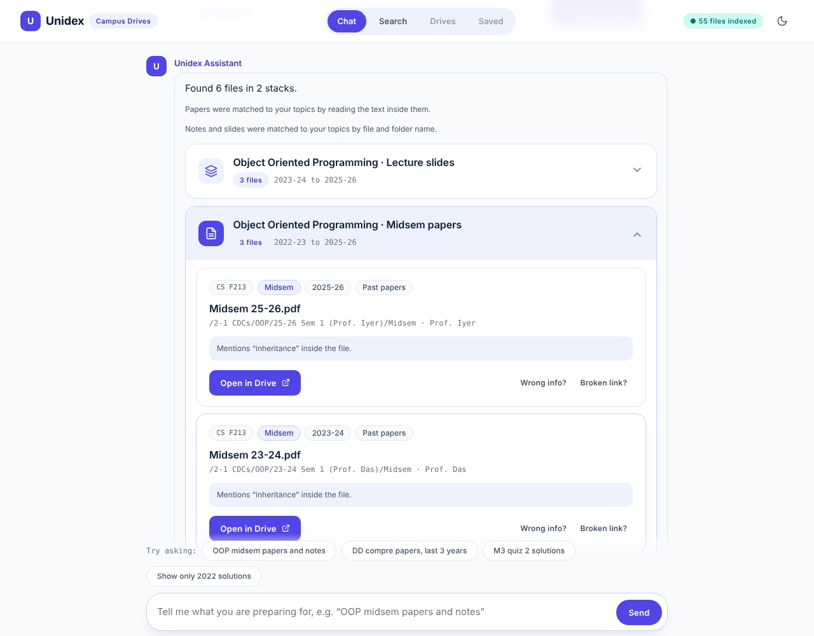
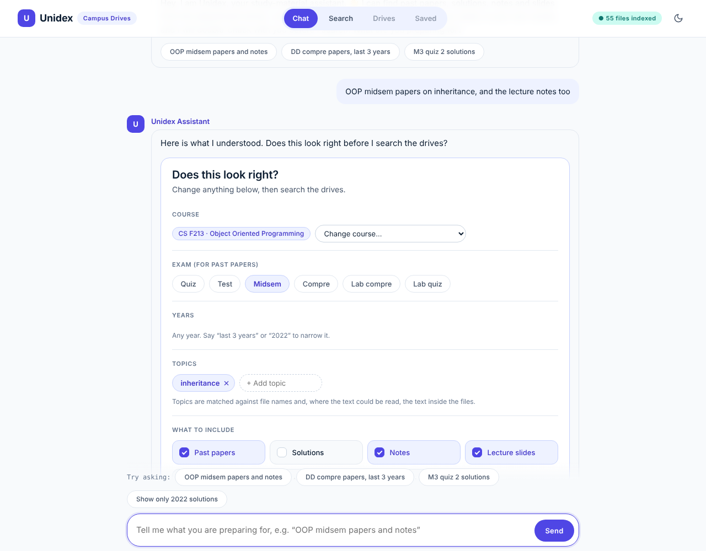
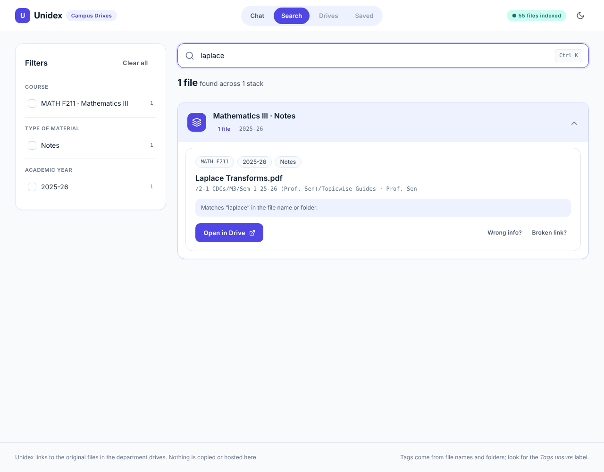
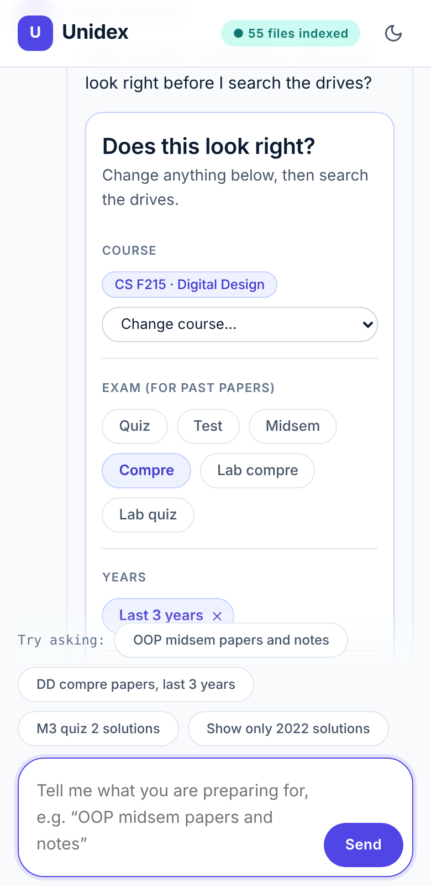
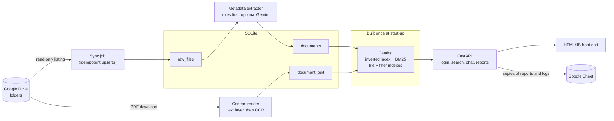
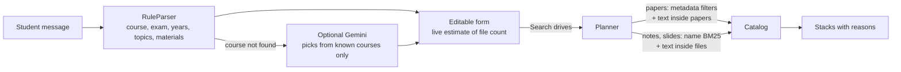
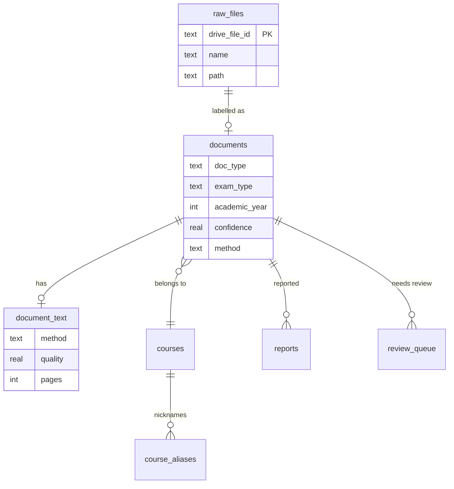

# Unidex

**One search box for scattered college Google Drives.** Ask in plain words, for example
*"OOP midsem papers on inheritance, and the lecture notes too"*, confirm what Unidex understood,
and get grouped result cards that open the original Drive files. Nothing is copied or hosted:
Unidex only indexes and links.

Built for BITS Pilani K. K. Birla Goa Campus, where past papers, solutions, notes and slides
live in many differently named folders. The search structures (inverted index, BM25 ranking,
trie, filter indexes) are written from scratch; the website, database and login are a small,
fully tested FastAPI + SQLite application with a plain HTML/JS front end.



> All screenshots use an **invented sample drive** (`data/sample/sample_drive.csv`). The real
> drives are not part of this repository, and the live site only signs in college accounts.

## What it does

- **Chat that checks itself.** A rule-based parser reads the message (course, exam, years,
  topics, kinds of material) and shows an editable form *before* searching. No language model is
  needed; an optional Gemini helper is only asked to pick a course when the rules find none.
- **Search by topic inside papers.** File names rarely say what a paper covers, so Unidex reads
  the PDFs (text layer first, OCR for scans) and searches the text. Papers it could not read
  (handwriting, poor scans) are listed last and labelled as not checked, never silently dropped.
- **Stacks, not a flat list.** Results are grouped (course, material, exam) so ten midsem papers
  appear as one card group, each file with a plain-language reason it matched.
- **A normal search page too:** autocomplete, live filters with counts, and the same stacks.
- **Always the original file.** "Open in Drive" links to the source; "Wrong info?" and
  "Broken link?" reports go to the maintainer.
- **Login limited to the college.** Google sign-in (OIDC with PKCE) accepts a college address
  only when Google also vouches for the college domain.

| Confirm what was understood | Plain search with live filters |
|---|---|
|  |  |

| College-only sign-in | Works on a phone |
|---|---|
|  |  |

## How it works



Chat is stateless on the server: the browser sends back the previous interpretation, so a
restart never loses a conversation.



The data model keeps the Drive listing separate from what Unidex derives from it, so a re-sync
never overwrites a human correction:



## Fundamentals

| Area | What is in the code |
|---|---|
| **Data structures and algorithms** | Inverted index with postings ([`inverted_index.py`](src/unidex/search/inverted_index.py)), BM25 scoring ([`bm25.py`](src/unidex/search/bm25.py)), trie for autocomplete ([`trie.py`](src/unidex/search/trie.py)), tokenizer with light plural stemming and word/number splitting, set-based facet filters (OR inside a facet, AND across facets), top-k selection with a heap |
| **Databases** | Normalised SQLite schema with constraints and indexes ([`schema.sql`](src/unidex/db/schema.sql)), repository classes, idempotent upserts keyed by Drive id, transactional sync that hides vanished files instead of deleting them, resumable batch jobs, snapshot export |
| **AI** | Rules-first metadata extraction with confidence scores and a review queue, optional LLM fallback behind a rate-limit budget, OCR with a text-quality gate that rejects garbled handwriting, a rule-based natural-language parser |
| **OOP and design patterns** | Strategy (`SearchStrategy`, OCR engines, `EventSink`), abstract bases (`FileSource` for CSV and Drive, `LLMClient`), dependency injection by constructor and callable, custom exception hierarchy, frozen dataclasses |
| **Security** | OpenID Connect with PKCE, state and nonce; domain check that needs both the email domain and Google's hosted-domain claim; signed cookies; hashed user ids in logs; read-only Drive scope; secrets only in the environment |

## Measured results

From [`docs/results.md`](docs/results.md), produced by `python scripts/measure.py` on the real
collection (1,134 files from 5 courses):

| What | Result |
|---|---|
| Files labelled with confidence 0.8 or more | 97%; of all files, 1,057 were labelled by rules, 76 by hand review and 1 by the language model |
| Name search, right file in the top 5 (28 hand-written queries) | BM25 26/28, MRR 0.90; a naive scan 25/28, MRR 0.86 |
| Search time (ranking, filters, facet counts) | median 1.4 ms, 95th percentile 10.5 ms |
| Papers, solutions and tutorials searchable by topic | 341 of 405 PDFs (84%): 234 from the text layer, 107 through OCR |
| Content search self-test | the file a query was drawn from came first for 89% and in the top 5 for 100% |
| Chat message reading (41 messages) | 38 fully correct |

Read these honestly:

- BM25 beats the naive scan only slightly on this small, tidy test set, and is about 2x faster on
  a collection 100 times larger. It is not a dramatic win; the point was to build and measure it.
- The content self-test uses rare words taken from the files themselves, so it is an upper
  bound on the index, not proof that students phrase topics that way.
- The chat messages were written by the developer and the rules were tuned after seeing
  failures, so 38/41 is not a held-out score.
- Handwritten solutions stay unsearchable by content (70% of solutions are searchable).

## Try it yourself (with the sample drive)

```powershell
python -m venv .venv
.venv\Scripts\Activate.ps1
pip install -e ".[dev]"
copy .env.example .env
python scripts/init_db.py
python scripts/load_csv.py --csv data/sample/sample_drive.csv
python scripts/extract_metadata.py
python scripts/serve.py          # open http://127.0.0.1:8000
```

On macOS or Linux use `source .venv/bin/activate` and `cp`. Locally the site is open (no login);
login switches on when the Google settings are present. The test suite (`python -m pytest`,
700+ tests), `ruff` and `mypy --strict` all run clean.

More: [developer guide](docs/guide.md) (loading real drives, Drive sync, reading PDF contents,
measuring), [deployment](docs/deploy.md), and [design decisions](docs/decisions.md) with the
reasons and the known gaps.

## Project layout

```
src/unidex/
  search/       tokenizer, inverted index, BM25, trie, catalog, grouping, measurement helpers
  db/           schema, connection, repositories, snapshot export
  ingestion/    CSV and Drive sources, sync job, comparison, downloads
  extraction/   path parser, rules, optional LLM extractor, review queue
  content/      PDF text and OCR readers, quality gate, pipeline
  chat/         parser, planner, optional course resolver, evaluation
  auth/         Google sign-in, Drive sign-in, domain policy
  api/          FastAPI app, routes, usage log, durable event sink
web/            plain HTML, CSS and JavaScript front end
scripts/        command-line tools (load, sync, extract, read, measure, serve, export)
tests/          unit and integration tests, including fake Google and fake Drive servers
```

## Limits and honest notes

- Only PDFs are read for content; `.pptx` slides are searched by name.
- Mathematical symbols extract poorly, and handwriting is not searchable.
- The free-text Search tab does not use paper contents yet; chat does.
- The Gemini helper has been tested with a fake client only.
- A Drive sign-in in Google's Testing mode expires every 7 days, so syncing needs a fresh
  `drive_login.py`; the website's own sign-in is not affected.
- The college's file contents belong to the college and its teachers. This repository contains
  only code, invented sample data and aggregate numbers.

## License

[MIT](LICENSE) for the code. The sample data is invented.
